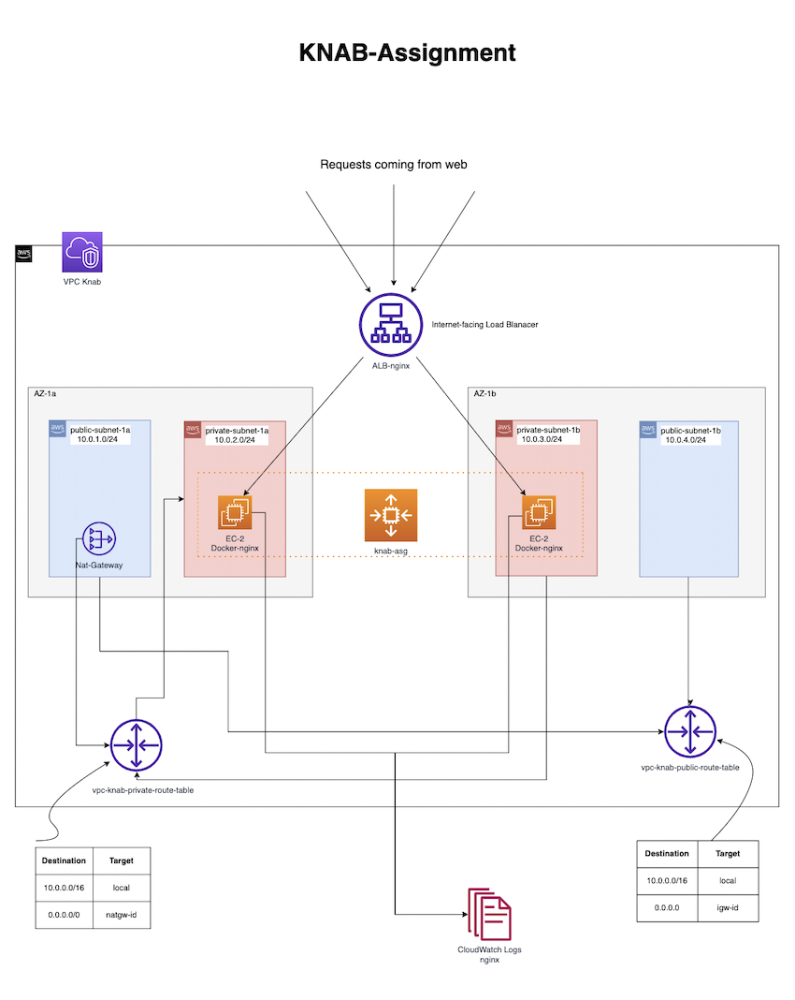

The Assignment is completed in terraform, below is the architecture diagram and the steps to run.

# Steps to run:
===================

Once you have terraform installed, clone the files and then run below Commands.

>> Initialize Terraform:
terraform init

>> Validate Terraform configuration files:
terraform validate

>> Format Terraform configuration files:
terraform fmt

>> Review the terraform plan:
terraform plan

>> Create Resources:
terraform apply -var="aws_region=REGION"

Example: terraform apply -var="aws_region=us-east-1"

